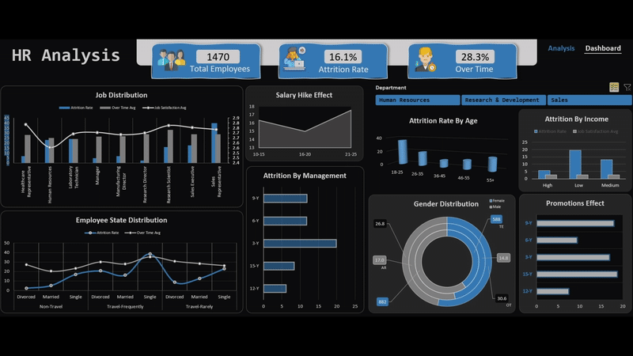

Built and developed an Insightful interactive HR analytics dashboard to analyze employee attrition and workforce patterns. The project focused on transforming raw HR data into actionable insights that help management understand key factors driving employee turnover.
Tools & Skills: Excel (Power Query, Power Pivot, DAX, Data Modeling, Visualization), HR Data Analysis, KPI Design, Insight Communication.

